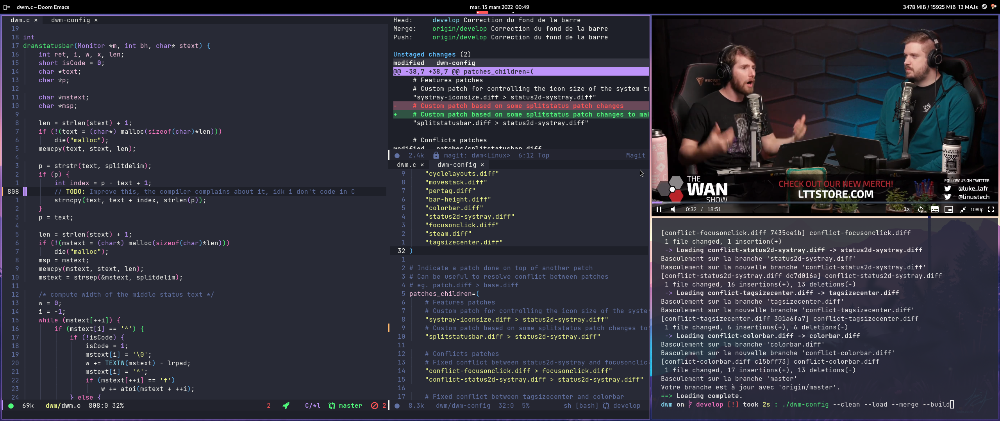

## dwm-config

This script can be used to:

- Load the configuration
- Merge the patches
- Build the configuration
- Install the configuration on the system
- Apply patches on top of another

Command line option:

- `--load`

    Load every patch as a branch in the DWM directory/repository.

- `--merge`

    Merge every branch into the __custom__ branch.

- `--build`

    Build DWM.

- `--install`

    Clean the DWM directory/repository, load the configuration, merge it, build it and installs DWM on the system.

- `--abort`

    Execute `git merge --abort` in case you want to speed up the process.

- `--clean`

    Cleans the DWM directory/repository.

Thanks to [Mageas](https://gitlab.com/Mageas) for his [suckscripts](https://gitlab.com/Mageas/dotfiles/-/tree/master/stow_root/scripts/usr/bin) which were the base of this script.
